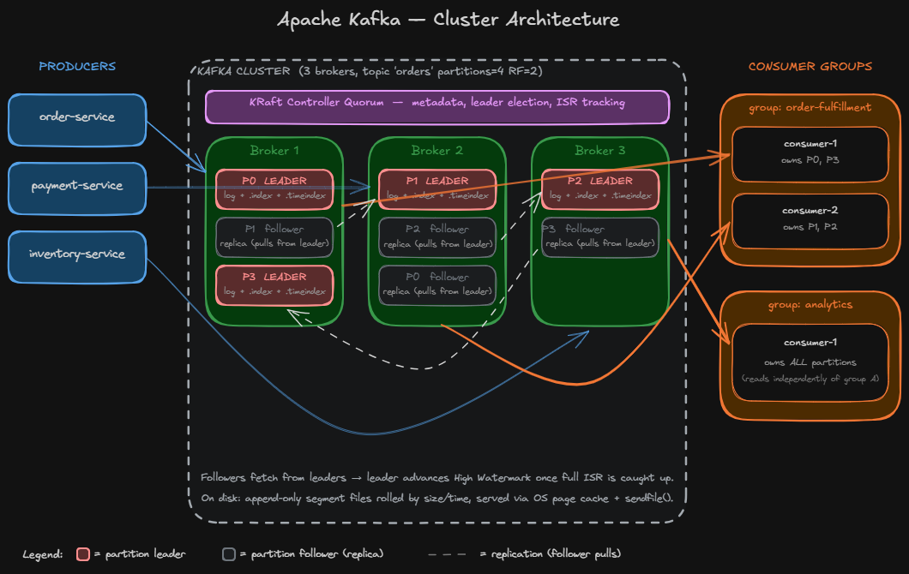
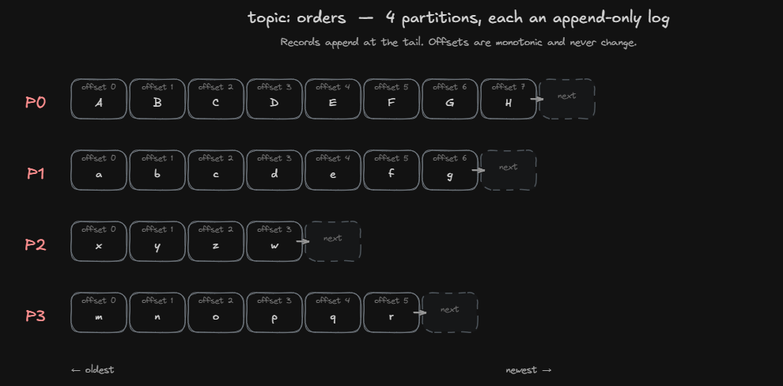
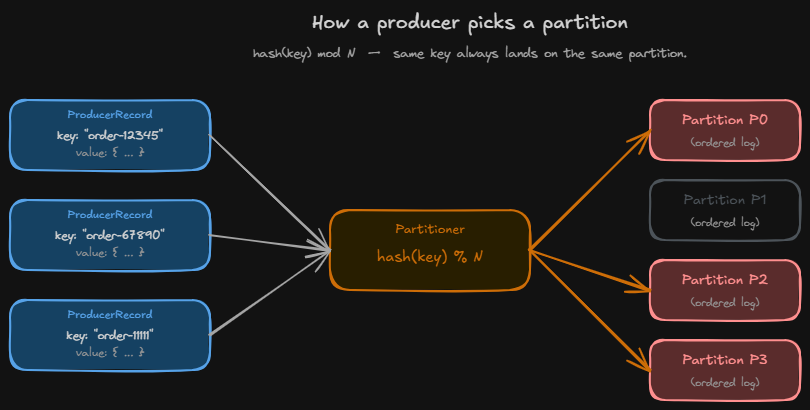
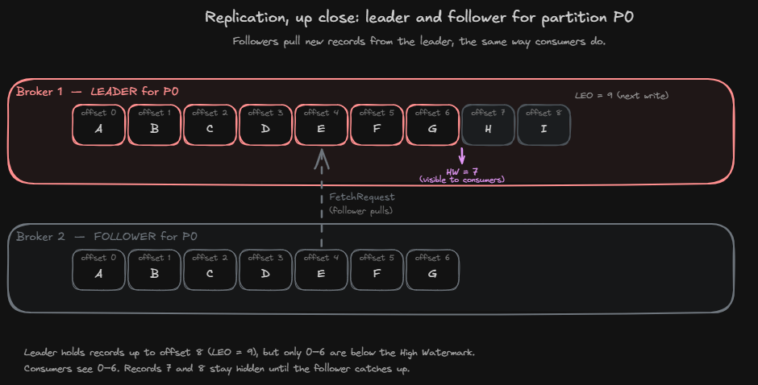
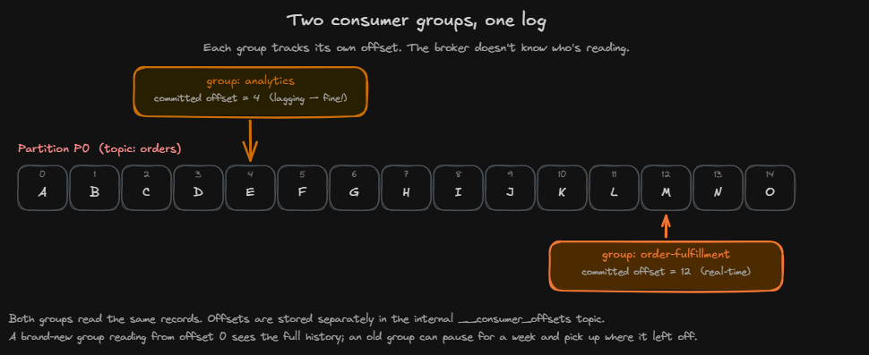

# Streaming Systems — Part 1: Apache Kafka Internals

> 📰 **Published on Medium as *"Apache Kafka Architecture for Beginners"*** — [read the polished version here](https://medium.com/@ahsanhussain17999/apache-kafka-architecture-for-beginners-a242e0ac105c).

## Why this series

If you've worked with data systems in the last decade, you've heard of Apache Kafka. You've probably used it. You may have inherited a Kafka cluster and only half-understood what the operations team meant by *leader*, *follower*, *ISR*, or *consumer lag*.

This series is my walk through modern streaming systems from first principles — Kafka first, then Apache Flink, then Apache Spark Structured Streaming. The goal is clarity, not exhaustiveness. By the end of this article you'll know what producers, brokers, partitions, leaders, followers, and consumer groups actually do — and how they fit together to move data through a real cluster.

No prior streaming experience required. If you've ever written code that talks to a database or an HTTP API, you're equipped for this.

## Kafka in one sentence

Before any diagrams, internalize this:

> **A *topic* is a sharded log. Each shard (a *partition*) lives on a *leader* broker, is replicated to *follower* brokers, and is consumed by exactly one consumer per *consumer group* at a time.**

Every Kafka concept — replication factor, ordering guarantees, consumer rebalancing, exactly-once semantics — follows from that sentence. Re-read it whenever the system feels mysterious.

## The architecture, end to end

*A Kafka cluster doing its job. Three zones: producers on the left, the cluster in the middle, consumer groups on the right.*

Three vertical zones tell the whole story:

- **Left (blue).** *Producers* — application services that **write** data. In this example, `order-service`, `payment-service`, and `inventory-service` all emit events into a single topic called `orders`.
- **Middle (green).** The *Kafka cluster* — three brokers (servers) hosting the topic's four partitions. The purple bar at the top is the **KRaft Controller Quorum**, which manages cluster metadata: leader elections, ISR tracking, broker membership. It is *not* on the data path.
- **Right (orange).** *Consumer groups* — `order-fulfillment` and `analytics` — application services that **read** the same data for different purposes.

Three arrow colors carry three different stories:

- **Blue arrows** are the write path — producers sending records to the broker that leads their target partition.
- **Dashed gray arrows** are replication — followers pulling new records from leaders to stay in sync.
- **Orange arrows** are the read path — consumers fetching records from leaders.

Each broker hosts a mix of leader partitions (red borders) and follower partitions (gray borders). Same partition, two copies, very different roles. The rest of the article unpacks why.

## Partitions: the unit of parallelism

Every topic in Kafka is split into one or more partitions. A partition is the actual physical thing — an ordered, append-only log file on disk.

*A topic is split into N partitions. Each partition is its own ordered log, with records appended at the tail.*

Each record gets a unique 64-bit integer called its **offset**. Offsets are monotonic within a partition; once assigned, they never change. Offset 0 is the oldest record still on disk; the highest offset is the most recent. Append-only means records are never modified or deleted in place — they age out only when retention (time- or size-based) deletes whole log segments.

Splitting a topic into N partitions gives you two things at once:

1. **Parallelism.** N producers can write to a topic in parallel; up to N consumers in a group can read in parallel.
2. **Per-key ordering.** Records with the same key always go to the same partition (we'll see how in a moment), so they're guaranteed to be read in the order they were written.

There is no global ordering *across* partitions. That's the deliberate trade-off Kafka makes for horizontal scale.

### How a producer picks a partition

*The producer hashes the key and takes modulo N. Same key → same partition, always.*

When your application calls `producer.send(record)`, the producer client:

1. Takes the record's key (as bytes, after serialization).
2. Hashes it.
3. Computes `hash(key) mod N` (where N is the partition count) to pick a partition.

Same key → same hash → same partition, always. This is why choosing a good key matters. Records that need to be ordered together — every event for a single `userId`, every update for a single `orderId` — must share a key. Records that don't (independent log lines, anonymous clicks) can be keyless and round-robined across partitions for even load.

## Leaders and followers

A topic is created with a **replication factor**. RF=2 means every partition has two copies on two different brokers. RF=3 — the production standard — means three copies on three brokers.

Among the copies of a partition, exactly one is the **leader**. The rest are **followers**.

*The leader holds 9 records (LEO = 9). The follower has caught up to offset 6. Only records below the High Watermark (HW = 7) are visible to consumers.*

The leader does all the work that matters:

- Producers write to the leader.
- Consumers read from the leader.
- Followers do **not** serve clients. Their only job is to keep an up-to-date copy of the leader's log so they can take over if the leader's broker dies.

Replication is **pull-based**. Each follower sends a `FetchRequest` to the leader — the exact same protocol consumers use — and pulls any records it hasn't seen yet. Leaders never push. This keeps brokers simple: serving a follower is no different from serving a consumer.

Two markers per partition are worth knowing:

- **LEO (Log End Offset)** — the offset of the next record that will be appended on a given replica. In the diagram, the leader's LEO is 9.
- **HW (High Watermark)** — the highest offset that **every** in-sync replica has caught up to. In the diagram, HW = 7.

Only records *below* the HW are visible to consumers. Records at offsets 7 and 8 physically exist on the leader's disk, but consumers cannot see them yet. Why? Because if the leader crashed right now, the follower would be elected the new leader, and the follower doesn't have records 7 and 8 — they would vanish. By hiding them until the follower has caught up, Kafka guarantees consumers never see records that could later disappear.

The set of replicas that are caught up to the leader is called the **ISR — In-Sync Replicas**. A follower that falls behind for too long is evicted from the ISR; when it catches back up, it rejoins. The cluster controller (the purple bar in the hero diagram) tracks these transitions and decides who becomes leader if the current leader's broker dies.

## Producers: how data gets in

You've already seen most of this. The full sequence:

1. Application calls `producer.send(record)`.
2. Producer hashes the record's key and picks a partition.
3. Producer looks up which broker currently leads that partition (it asks the cluster for metadata and caches the answer).
4. Producer sends the record to that leader.
5. Leader appends the record to its log file — a sequential write through the OS page cache.
6. Followers in the ISR fetch the new record.
7. Once the ISR has caught up, the leader advances the High Watermark and acknowledges the producer.

The setting that controls step 7 is `acks`. With `acks=all`, the producer waits for the full ISR — the durable, "no data loss on broker failure" choice. With `acks=1`, the leader acknowledges as soon as its own write succeeds, which is faster but loses unreplicated records if the leader dies before followers catch up. For anything that matters, use `acks=all`.

## Consumers and consumer groups

A consumer reads records from one or more partitions. By itself it's nothing special — it fetches records and tracks where it is.

The interesting unit is the **consumer group**. A consumer group is a set of consumers cooperating to read a topic together. Two rules govern it:

1. **Each partition is read by exactly one consumer in the group.** If a topic has 4 partitions and the group has 2 consumers, each consumer is assigned 2 partitions. If the group has 4 consumers, each gets 1 partition. If the group has 8 consumers, 4 of them sit idle — you can never have more *active* consumers in a group than the topic has partitions.
2. **Different consumer groups are independent.** They don't share work, they don't share progress, they don't know about each other.

*Two consumer groups, one log. Each tracks its own offset; one can lag without affecting the other.*

Picture one partition with 15 records and two consumer groups reading it. `order-fulfillment` is at offset 12 — it's keeping up with the live stream and charging cards in near real time. `analytics` is at offset 4 — it's lagging an hour behind, batching records into a data warehouse, and that's perfectly fine.

Both groups read the same records. Their progress is stored separately in an internal Kafka topic called `__consumer_offsets`, keyed by `(group, topic, partition)`. The broker doesn't track who's reading — consumers commit their own offsets when they're done processing.

This is the entire reason Kafka decouples systems so cleanly. A new analytics team can spin up a brand-new consumer group, point it at the same `orders` topic, start from offset 0, and replay every order ever placed — and the existing fulfillment pipeline never notices. Adding consumers is free. The log is the source of truth.

## One record's journey, end to end

Tying it all together. An order arrives:

1. **`order-service`** builds an `OrderPlaced` record keyed by `orderId` and calls `send()`.
2. Producer hashes `orderId` → P0. P0's leader is Broker 1. The record goes there.
3. **Broker 1** appends the record to its P0 log (page cache, then disk).
4. **Broker 2** holds the P0 follower. It pulls the new record via `FetchRequest`.
5. Broker 1 sees Broker 2 has caught up → advances the **High Watermark** for P0 → ACKs the producer.
6. **`order-fulfillment` consumer-1** is polling Broker 1 for P0. It fetches the record, charges the card, sends the confirmation email, commits its offset.
7. **`analytics` consumer-1** is *also* polling Broker 1 for P0 — independently, from its own offset. It fetches the same record and writes it to the warehouse.

The producer is done at step 5. Whether or not consumers have read the record yet is not the producer's problem. That separation — producers don't know about consumers, consumers don't know about producers, the log keeps everything — is the entire reason Kafka exists.

## What's next in the series

This was the cluster-level view. Future parts go deeper into one piece at a time:

- **Part 2 — The Kafka write path.** Producer batching, idempotence, compression, the on-the-wire `ProduceRequest` format, and what gets written to disk byte for byte.
- **Part 3 — The Kafka read path.** Consumer rebalancing, the cooperative-sticky assignor, fetch sessions, and why `enable.auto.commit=true` will eventually burn you.
- **Part 4 — Exactly-once and transactions.** What "exactly-once" actually means, why the naive interpretation is impossible, and how Kafka transactions fence zombies and atomically commit across partitions.
- **Part 5 onward — Apache Flink.** State backends, checkpoint barriers, watermarks, and why Flink is the most thoughtful piece of distributed-systems engineering you'll meet.
- **Then — Apache Spark Structured Streaming.** The micro-batch model, the state store, where Spark wins and where Flink wins.

If anything in this article was unclear or wrong, tell me — I'm writing this series as I learn, and corrections are gold.

---

*Diagrams built in Excalidraw. Source files: [`source/`](./source/). Exported PNGs: [`images/`](./images/).*
