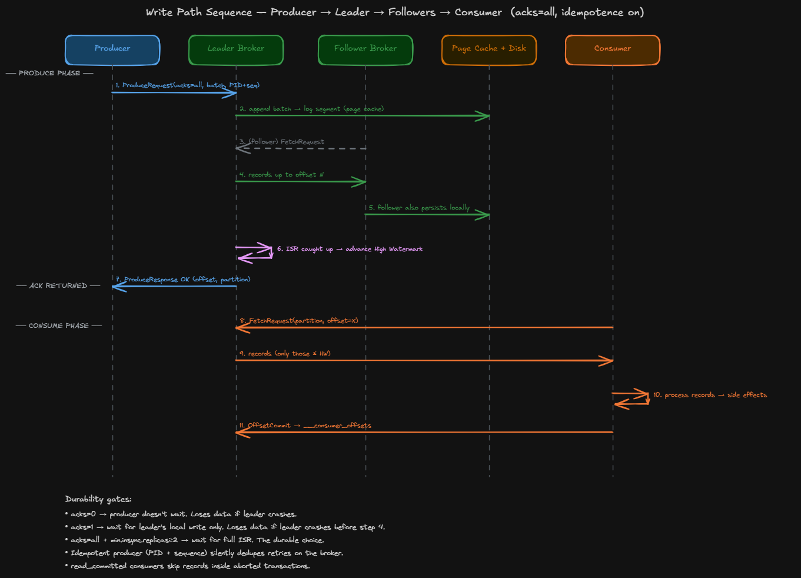
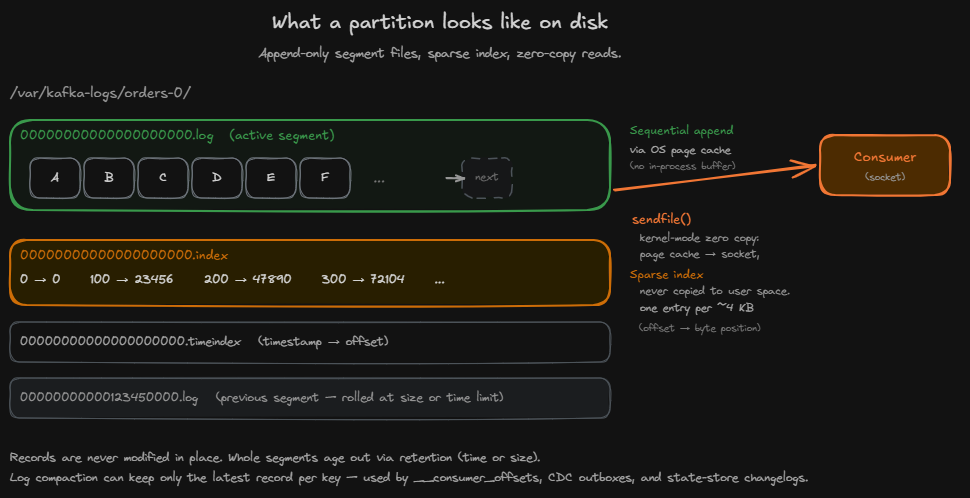

# How One Record Travels Through Apache Kafka

## Where we are in the series

[Part 1](./part-1-kafka-internals.md) covered the static picture — producers, brokers, partitions, leaders, followers, consumer groups.

This part is about motion. One record, traced from `producer.send()` to a committed offset. Eleven steps, three phases, one diagram.

## The picture, all at once

*One record from `producer.send()` to `OffsetCommit`. Five lifelines, eleven messages, three phases.*

Five lifelines:

- **Producer** — your application.
- **Leader Broker** — owns the target partition.
- **Follower Broker** — holds a replica.
- **Page Cache + Disk** — the kernel's file cache and the underlying storage. Both correctness and performance depend on how the brokers use it.
- **Consumer** — polling the leader.

Three phases: **Produce**, **Replicate**, **Consume**, separated by an explicit "ACK RETURNED" between steps 7 and 8.

## Phase 1: Produce (steps 1–2)

`producer.send(record)` serializes the record, picks a partition via `hash(key) mod N`, and sends a **ProduceRequest** to that partition's leader.

The request carries:

- A **record batch** — records destined for the same partition, grouped and compressed as a single unit. Batching is one of Kafka's biggest throughput wins.
- The `acks` setting (step 7).
- The producer's **PID + monotonic sequence number** per partition. The broker remembers the last few sequences per PID; a retry with a duplicate sequence is silently dropped. That's idempotence.

The leader appends the batch to its active log segment — through the **OS page cache**, not directly to disk. The page cache is a kernel-managed region of RAM that mirrors recently-written file pages; the kernel flushes dirty pages on its own schedule. From Kafka's perspective, the write is "done" the moment it lands in the cache.

## Phase 2: Replicate (steps 3–5)

The mechanic that surprises most newcomers: **followers pull. Leaders never push.**

Each follower constantly sends a **FetchRequest** to the leader carrying its current **LEO (Log End Offset)** — the offset of the next record it would write — and asks for everything past that. The leader returns the new records; the follower appends them through its own page cache; its LEO advances.

The leader tracks every follower's LEO. A follower is **in-sync** if its LEO is within `replica.lag.time.max.ms` (default 30s) of the leader's. The in-sync followers plus the leader form the **ISR (In-Sync Replicas)**. A laggard is evicted; when it catches back up, it rejoins.

The ISR is the durability boundary. Only ISR members can be elected leader, and only data replicated to the full ISR counts as durable.

## The High Watermark moves (step 6)

Two offsets per partition:

- **LEO** — next offset to write (per replica).
- **HW (High Watermark)** — `min(LEO across the ISR)`. The boundary between "fully replicated" and "pending."

**Consumers only see records below the HW.** If a record is below the HW, the leader can crash and any ISR follower can take over without losing it. Records at or above the HW exist only on the leader's disk — they'd vanish on failover, so Kafka hides them.

## Step 7: ACK — what `acks` actually controls

When the leader sends the **ProduceResponse** depends entirely on `acks`:

- **`acks=0`** — no ACK. Fire-and-forget. Lost on leader crash. Use only for non-critical telemetry.
- **`acks=1`** — ACK after the leader's local write. Lost if the leader crashes before any follower replicates.
- **`acks=all`** — ACK after the full ISR has replicated. Combined with `min.insync.replicas ≥ 2`, no data loss as long as two brokers stay healthy.

`min.insync.replicas` is the safety latch. If the ISR shrinks below it, `acks=all` producers start getting `NotEnoughReplicas` errors — the cluster fails closed rather than silently accepting writes that aren't actually replicated.

Production default for anything that matters: **`acks=all` + `min.insync.replicas=2` + `enable.idempotence=true`**.

## Phase 3: Consume (steps 8–9)

The consumer sends a **FetchRequest** — the *same* protocol followers use — with:

- `fetchOffset`: where to start.
- `maxWaitMs`: how long to long-poll if nothing's new.
- `isolationLevel`: `read_uncommitted` (records up to HW) or `read_committed` (records up to the **LSO**, the offset before any open transaction).

The broker streams records via **`sendfile()`** — a Linux syscall that copies bytes from a file descriptor straight to a network socket, never through user space. The broker doesn't decompress, doesn't parse, doesn't re-encode. The consumer receives the *exact bytes the producer sent* and decompresses on its end.

This is why Kafka can saturate a NIC on very little CPU. The hot path is page cache → socket.

## Storage mechanics — why this is fast

*One partition on disk. The active `.log` receives sequential appends through the page cache; `sendfile()` streams bytes straight from the page cache to consumer sockets.*

Each partition is a directory of segment files:

- `.log` — the records.
- `.index` — sparse map of offset → byte position (~one entry per 4 KB). Lookups binary-search the index, then scan forward.
- `.timeindex` — same idea for timestamp → offset.

When the active segment hits `log.segment.bytes` (default 1 GiB) or `log.roll.ms` (default 7 days), Kafka rolls it: closes the files, opens a new active segment with a higher base offset.

Three properties make this fast:

1. **Sequential writes.** Disks — spinning or SSD — are dramatically faster on sequential I/O. Records are never modified in place.
2. **Page cache, not a JVM buffer.** Hot data lives in RAM via the kernel. No extra layer of caching inside Kafka. Low GC pressure.
3. **Zero-copy reads.** `sendfile()` streams page-cache pages straight to sockets.

Retention works on whole segments. Old segments age out and get deleted. **Log compaction** is the alternative — keep only the latest record per key — used for `__consumer_offsets`, CDC outboxes, and state-store changelogs.

## Steps 10–11: Process and commit

The consumer processes the records — charges the card, writes to the DB, emits to another topic. When done with a batch, it sends an `OffsetCommitRequest` to the group coordinator, which persists it in `__consumer_offsets`, keyed by `(group, topic, partition)`.

A crash *after* processing but *before* committing means the replacement consumer reprocesses those records from the last committed offset. At-least-once delivery is the default, and **idempotent handlers** are how you survive it.

The trap: `enable.auto.commit=true`. Auto-commit fires on a timer, regardless of whether your handler finished. A crash mid-handler can leave records marked committed that were never actually processed. Use `enable.auto.commit=false` and `commitSync()` for anything that touches external state. Part 4 covers rebalancing and commit modes properly.

## Pulling it together

Every Kafka guarantee maps to a step in this picture:

- **Durability** — steps 3–6. `acks=all` waits for the full ISR; the HW advances only when everyone catches up; consumers never see records above the HW.
- **Throughput** — step 2 (batching, compression, sequential append) and step 9 (zero-copy). The broker is dumb on purpose.
- **Ordering** — comes free from the partition being a single append-only log behind a single leader.
- **Exactly-once** — idempotence in step 1 plus transactions across steps 2, 7, 11. Subject of Part 5.

Once you see the eleven-step picture, the rest of Kafka is detail.

## What's next

- **Part 3** — Producer write path, deep. The `RecordAccumulator`, compression options, `ProduceRequest` wire format byte for byte.
- **Part 4** — Consumer mechanics. Rebalancing, the cooperative-sticky assignor, fetch sessions, commit modes.
- **Part 5** — Exactly-once and transactions. The transactional protocol, zombie fencing, atomic commits across partitions.
- **Part 6+** — Flink, then Spark.

Corrections welcome.

---

*Diagrams in Excalidraw. Source: [`source/`](./source/). PNGs: [`images/`](./images/).*
